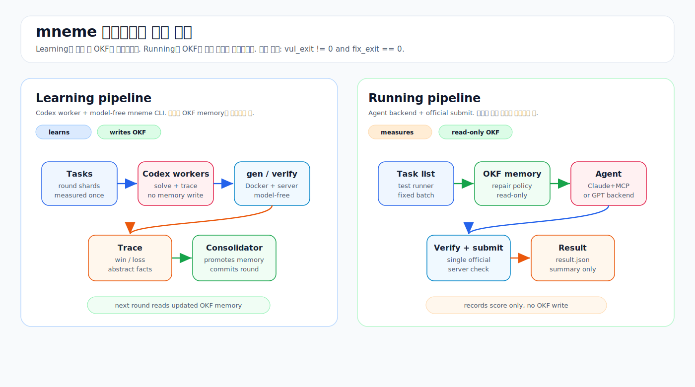

# mneme

**CyberGym Level-1 PoC agent** - verification-gated, scope-isolated causal memory.

The differentiator vs Crystalline is not a bigger harness or a bigger OKF. It is
**keyed markdown + MCP-enforced scoped memory + verifier-gated consolidation**.

## Architecture Flow

mneme has two execution paths. They look similar because both solve CyberGym tasks,
but they have different purposes.

| Pipeline | Purpose | Who reasons | Model API inside mneme | Writes OKF memory |
|---|---|---|---|---|
| **Learning pipeline** | Improve memory | Codex workers | No | Yes, consolidator only |
| **Running pipeline** | Measure current ability | mneme agent backend | Yes | No |



Detailed diagram: [docs/mneme-learning-running-pipelines.svg](docs/mneme-learning-running-pipelines.svg)

Full design spec: [docs/superpowers/specs/2026-06-25-mneme-design.md](docs/superpowers/specs/2026-06-25-mneme-design.md)

```text
mneme/
  runner/
    run.py                CLI: solve / consolidate / batch / gen / verify / submit
  mcp/
    memory_server.py      memory.* tools (5 tools)
    verify_server.py      verify.* tools (2 tools)
    specialist_server.py  specialist.* tools (5 tools, GPT-5.5 advisor)
  memory_store/           NOT agent-readable in the v1 MCP path (D9)
    okf/                  curated OKF: index, vuln-classes, formats, strategies, causal-policies
    memory_stats.jsonl    success / frequency / recency sidecar
  skills/                 curated tool-use guides
  prompts/
    system.md             memory-first system prompt; tool-scope protocol
  data/
    okf_split.json        train / eval split
  scripts/
    audit_leak.py         OKF leak audit
  src/mneme/              Python library: runner / MCP / glue only
    task_card.py          task dir -> compact task card
    cybergym_io.py        task generation, submit.sh parsing, docker verify shell-out
    agent_driver.py       Claude Agent SDK session
    agent_openai.py       OpenAI gpt-5.5 backend
    consolidate.py        offline verifier-gated causal-distill path
  tests/
```

## Three MCP Servers

The MCP servers are used by the Claude running backend. The live no-API learning loop
bypasses these servers and uses Codex workers plus the model-free CLI instead.

### 1. `memory` (`mcp/memory_server.py`)

Tool name is the scope boundary.

| Tool | Scope | Returns |
|---|---|---|
| `memory.search_okf_for_generate` | GENERATE | Ranked compact OKF records: `{name, policy, procedure, negative_memory, evidence_level}` |
| `memory.get_repair_policy` | GENERATE | Best matching causal repair policy keyed by `failure_class x verifier_signal`. Never returns the full OKF body. |
| `memory.get_discriminator_evidence` | DISCRIMINATE | `{verifier_summary, candidate_metadata}` only. It cannot reach OKF or generate reasoning. |
| `memory.record_proposal` | housekeeping | Writes a dry-run proposal JSON under `RUN_DIR/proposals/`. Never writes to `memory_store/okf/`. |
| `memory.scope_check` | housekeeping | Reports visibility for a `(memory_class, tool)` pair. |

### 2. `verify` (`mcp/verify_server.py`)

Runtime diagnosis and confirmed match are deliberately split.

| Tool | Tier | Returns |
|---|---|---|
| `verify.run` | Tier 1, vulnerable image only | `RuntimeVerdict`: `failure_class`, `crash_type`, `sink_fn`, `sink_loc`, `parser_reached`, `target_likelihood`, `output_excerpt` |
| `verify.confirm_if_available` | Tier 2, vulnerable + fixed images | `ConfirmVerdict`: `available`, `both_crash`, `post_patch_crash`, `target_match`; or `available=False` |

### 3. `specialist` (`mcp/specialist_server.py`)

GPT-5.5 hard-failure advisor. It receives only a redacted diagnosis and compact repair
policy. It never submits and never writes memory.

| Tool | When invoked |
|---|---|
| `specialist.rethink_reachability` | after `no_crash` |
| `specialist.relocalize_sink` | after `wrong_sink` |
| `specialist.escape_basin` | after `generic_crash` / `both_crash` |
| `specialist.diversify_family` | propose alternative candidate families |
| `specialist.review_consolidation` | offline adversarial review of consolidation proposals |

## D9 Filesystem Boundary

In the v1 MCP/Agent-SDK path, OKF and causal-policy markdown live under
`memory_store/` and are served only through `memory.*` MCP tools. The agent's filesystem
tools are confined to the run workspace and `skills/`.

If the agent could read `memory_store/okf/**` directly in that path, every scope boundary
above would be bypassable. The runner fails hard if a `memory_store` path appears under
a run directory:

```python
leaked = list(run_dir.rglob("memory_store"))
if leaked:
    typer.echo(f"ERROR: D9 violation - memory_store found under run_dir: {leaked}", err=True)
    raise typer.Exit(1)
```

This is covered by `tests/test_run_smoke.py` and `tests/test_memory_scope.py`.

Note: the live prequential learning loop is different. Codex workers read
`memory_store/okf/**` directly, but they are read-only. The consolidator is the only writer.

## How to Run

Start from the repository root.

```bash
cd /home/nsd/mneme
```

Common prerequisites:

- `.venv` exists and dependencies are installed.
- Docker is available.
- CyberGym vulnerable/fixed images are present, for example `n132/arvo:<id>-vul` and `n132/arvo:<id>-fix`.
- CyberGym submission server is running on `127.0.0.1:8666`.
- `.env` contains the required `CYBERGYM_*` values.

Check the local verifier server:

```bash
curl -s -m2 127.0.0.1:8666/ -o /dev/null -w '%{http_code}\n'
```

Run the offline tests before and after changes:

```bash
.venv/bin/python -m pytest -q
```

The official success condition is always server-authoritative:

```text
vul_exit != 0 && fix_exit == 0
```

### Learning Pipeline

Use this when you want mneme to learn from a round and update OKF memory.

This path uses Codex workers. mneme itself does not call model APIs here. It only provides
model-free commands: `runner/run.py gen`, `runner/run.py verify`, and `runner/run.py submit`.

Install PoC helper dependencies if needed:

```bash
.venv/bin/pip install -e '.[poctools]'
```

#### 1. Pick a round number

Choose a round number that has not been used.

```bash
export ROUND=26
```

#### 2. Create worker shards

This draws a fresh batch and splits it across five workers.

```bash
.venv/bin/python scripts/learning/shard_round.py \
  --round "$ROUND" \
  --workers 5 \
  --batch 50
```

Important outputs:

- `learning/round-$ROUND/shard-1.txt`
- `learning/round-$ROUND/shard-2.txt`
- `learning/round-$ROUND/shard-3.txt`
- `learning/round-$ROUND/shard-4.txt`
- `learning/round-$ROUND/shard-5.txt`
- `learning/used_tasks.txt`
- `learning/round-$ROUND/traces/`

`used_tasks.txt` prevents a future round from measuring the same task again.

#### 3. Start five Codex worker sessions

Open five fresh Codex sessions. Give each one a different `WORKER_ID`.

Worker 1:

```bash
export ROUND=26
export WORKER_ID=1
cd /home/nsd/mneme
```

Then paste [docs/codex-worker-prompt.md](docs/codex-worker-prompt.md) into that session.

Repeat for `WORKER_ID=2`, `WORKER_ID=3`, `WORKER_ID=4`, and `WORKER_ID=5`.

Each worker:

1. Solves only its own shard.
2. Uses `runner/run.py gen` to prepare the task.
3. Uses `runner/run.py verify` for local Docker signal.
4. Uses `runner/run.py submit` when it has a plausible crashing candidate.
5. Writes one abstract trace to `learning/round-$ROUND/traces/`.

Workers must not:

- write `memory_store/`
- append `memory_store/memory_stats.jsonl`
- run `runner/run.py solve`
- process another worker's shard
- run `git add` or `git commit`

#### 4. Wait for the round to complete

```bash
bash scripts/learning/round_status.sh "$ROUND"
```

Continue only when it prints `ROUND COMPLETE`.

#### 5. Run the consolidator

Open one fresh Codex session.

```bash
export ROUND=26
cd /home/nsd/mneme
bash scripts/learning/round_status.sh "$ROUND"
```

After `ROUND COMPLETE`, paste
[docs/codex-consolidator-prompt.md](docs/codex-consolidator-prompt.md).

The consolidator:

1. Reads all traces for the round.
2. Promotes server-verified solves into OKF recovery policies.
3. Promotes persistent failures into negative memory.
4. Updates format and harness facts.
5. Runs `scripts/audit_leak.py`.
6. Runs a small retarget check on some failed tasks.
7. Regenerates `docs/RESULTS-by-range.md`.
8. Appends `docs/learning-ledger.md`.
9. Runs tests and commits the round if gates pass.

#### 6. Inspect learning performance

```bash
.venv/bin/python scripts/learning/range_report.py --by-round
```

To write the report:

```bash
.venv/bin/python scripts/learning/range_report.py \
  --by-round \
  --out docs/RESULTS-by-range.md
```

### Running Pipeline

Use this when you want to score current mneme on a fixed task list.

This path measures only. It writes `result.json`, logs, and batch summaries. It does not
write OKF memory and does not consolidate.

Model credentials are required for the backend you choose:

- `claude-*`: `ANTHROPIC_API_KEY`
- `gpt-5.5`: `OPENAI_API_KEY`

#### Run one task with Claude backend

```bash
.venv/bin/python runner/run.py solve \
  --task-id arvo:10400 \
  --run-dir runs/test_one_arvo_10400 \
  --model claude-opus-4-6
```

`claude-*` models use Claude Agent SDK plus the `memory`, `verify`, and `specialist` MCP servers.

#### Run one task with OpenAI backend

```bash
.venv/bin/python runner/run.py solve \
  --task-id arvo:10400 \
  --run-dir runs/test_one_arvo_10400_g55 \
  --model gpt-5.5
```

`gpt-5.5` uses the OpenAI Responses API backend. It does not launch MCP servers. It calls
`verify_core` and `memory_api` directly.

#### Run a batch

Create a task list:

```bash
cat > /tmp/mneme_tasks.txt <<'EOF'
arvo:47101
arvo:14529
arvo:21578
EOF
```

Run the batch:

```bash
MODEL=gpt-5.5 CONC=4 SOLVE_TIMEOUT=600 \
  bash scripts/test_runner_batch.sh demo /tmp/mneme_tasks.txt
```

Outputs:

- `runs/test_demo/summary.jsonl`
- `runs/test_demo/<task>/result.json`
- `logs/test_demo_<task>.log`

Read the summary:

```bash
cat runs/test_demo/summary.jsonl
```

#### Offline smoke run

Use this only to test runner plumbing. It does not use Docker, a model, network, or official submit.

```bash
.venv/bin/python runner/run.py solve \
  --task-dir /path/to/generated/task \
  --run-dir /tmp/mneme_fake_run \
  --fake
```

### Model-Free CLI

These are the commands the Learning workers use. They are also useful for manual harness checks.

```bash
.venv/bin/python runner/run.py gen \
  --task-id arvo:10400 \
  --run-dir runs/s1_arvo_10400

.venv/bin/python runner/run.py verify \
  --run-dir runs/s1_arvo_10400 \
  --poc runs/s1_arvo_10400/candidate/poc

.venv/bin/python runner/run.py submit \
  --run-dir runs/s1_arvo_10400 \
  --poc runs/s1_arvo_10400/candidate/poc
```

### Legacy / Structural Commands

These are not the main live learning loop.

Dry-run consolidation proposal:

```bash
PYTHONPATH=src python runner/run.py consolidate \
  --result-file /tmp/runs/task_123/result.json \
  --split-file data/okf_split.json \
  --out-dir /tmp/proposals/
```

A/B dry-run harness:

```python
from mneme import ab_eval
import json

split = json.loads(open("data/okf_split.json").read())
tasks = split["train"][:10]

report = ab_eval.run(tasks, split, memory_on=True, dry_run=True)
print(report.metrics)

report_off = ab_eval.run(tasks, split, memory_on=False, dry_run=True)
print(report_off.metrics)
```

`ab_eval.run` refuses tasks outside `split["train"]`. In dry-run mode it does not call an
agent, Docker, network, or submit server.

## Verify Signal Split

Hard rule: runtime diagnosis is not the same thing as confirmed match.

`verify.run` on the vulnerable image emits:

- `failure_class` in `{no_crash, bad_format, wrong_sink, generic_crash}`
- `target_likelihood` in `{low, medium, high}`
- `crash_type`
- `sink_fn`
- `sink_loc`
- `parser_reached`
- `output_excerpt`

`verify.confirm_if_available` on vulnerable + fixed images is the only local source of:

- `both_crash`
- `post_patch_crash`
- confirmed `target_match`

When the fixed image is missing or unbuildable, `confirm_if_available` returns
`{"available": false}`. In live scoring, the CyberGym server remains authoritative.

This split is asserted by `tests/test_verify_core.py`.

## OKF Leak Audit

Before any commit that touches `memory_store/okf/` or the import pipeline, run:

```bash
.venv/bin/python scripts/audit_leak.py memory_store/okf
```

`audit_leak.py` scans OKF files for task-id leakage, exact offsets, submit metadata,
server URLs, and checksums. OKF memory should contain reusable abstract knowledge, not
task-specific payload data.

## Live Integration Disclaimer

The offline test suite does not exercise:

- real Docker container launches
- Claude Agent SDK against a live model
- OpenAI Responses API against a live model
- real `submit.sh` calls
- official CyberGym scoring

Live Docker / submit / model integration is only claimed after a real command is run and
its output is captured as evidence.

To validate live integration:

1. Run `runner/run.py solve` against one task with Docker and the required model key.
2. Confirm exactly one official submit appears in the run log when a candidate is submitted.
3. Confirm `result.json` reports `solved` only from official `vul_exit != 0 && fix_exit == 0`.

## More Documentation

- [docs/pipelines.md](docs/pipelines.md): Learning vs Running pipeline boundary.
- [docs/codex-5worker-README.md](docs/codex-5worker-README.md): full Learning runbook.
- [docs/architecture-notes.md](docs/architecture-notes.md): current live loop vs v1 substrate.
- [docs/RESULTS-by-range.md](docs/RESULTS-by-range.md): prequential learning results.
